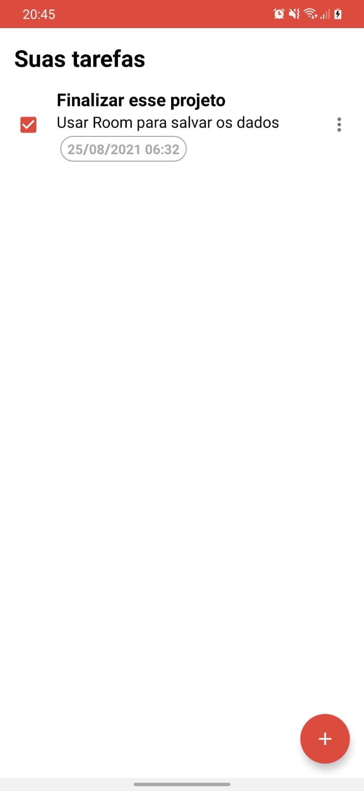

# To Do List 

Projeto desenvolvido no Santander Bootcamp - Mobile Developer. Usando Android Nativo com Kotlin. Foram aplicados conceitos como Recycler View e ferramentas de cliclo de vida do Androidx. Como extra adicionei o Room com Coroutines para armazenar os dados.

# Screenshots

  
 

